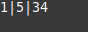
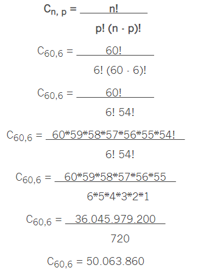

### PROJETO LOTERIA

 Esse programa tem como objetivo criar todas as sequencias possiveis da loteria. 

### Sequência Loteria
**Objetivo**
* _Números de 1 á 60_ 
* _Com 6 Digitos_ 
* _Sem repetição_ 
* _Em ordem crescente_ 

 Em uma analise mais profunda, foi possivel determinar um padrão para a sequência.

 Antes de realizar o código devemnos lembrar que os números não podem se repetir em nenhuma célula. E o código deve estar em ordem crescente, pois erros como 6 5 4 3 2 1, poderiam se repetir com 1 2 3 4 5 6.

 Vamos a analise.

 Percebi que a ultima posição, sempre quando atingisse o ultimo valor, que no caso seria 60, deveria somar um número a mais, da posição anterior.

 Como no exemplo a seguir, iremos utilizar apenas três posições para um melhor intendimento.

|  P1  |  P2  |  P3  |
|------|------|------|
|   1  |   2  |   3  |
 
 Sempre iremos manter o p1 e o p2, intactos, até o final do p3, que irá sempre somar um número, sem repetir os valores do p1 e do p2. 

Exemplo:

    
|  P1  |  P2  |  P3  |
|------|------|------|
|   1  |   2  |   3  |
|   1  |   2  |   4  |
|   1  |   2  |   5  |

 
Até
 

|  P1  |  P2  |  P3  |
|------|------|------|
|   1  |   2  |  60  |

 Ao atingir o ultimo valor da ultima posição, iremos somar um número a mais, no p2. Para manter em ordem e sem repetições, esse novo valor de p2 será o valor do p3 agora, mas com um número a mais.

Exemplo:

|  P1  |  P2  |  P3  |
|------|------|------|
|   1  |   2  |  60  |
|   1  |   3  |   4  |

 Então p2 será um valor a mais do anterior, ou seja, 2 + 1 = 3. E p3 será o valor novo de p2 mais um, ou seja 3 + 1 = 4.
Dessa forma, podemos fazer a sequencia em ordem crescente, sem repetições de valores nas células. 

 Dessa mesma forma faremos com o p2. Quando p2 atingir o penultimo valor da lista, ele irá acrescentar um número a mais para p1, em seguinda o p2 irá atribuir o valor de p1 para si, com um número a mais. Na sequência iremos atribuir o valor de p2 a p3 com um número a mais.

Exemplo:

|  P1  |  P2  |  P3  |
|------|------|------|
|   1  |  59  |  60  |
|   2  |   3  |   4  |
|   2  |   3  |   5  |
|   2  |   3  |   6  |

 
Até
 

|  P1  |  P2  |  P3  |
|------|------|------|
|   2  |   3  |  60  |

 Exemplo:

 O código começa com a sequencia 1,2,3 e termina com a sequencia 58,59,60. O código só irá terminar quando p1 atingir 58. 
Para sequencias com 6 digitos, ele deverá atingir 55, para terminar com 55,56,57,58,59,60.

 Para finalizar, a conta que devemos fazer para descobrir o total de números possiveis da loteria é:

 Assim também podemos decobrir quantas linhas o csv terá.
